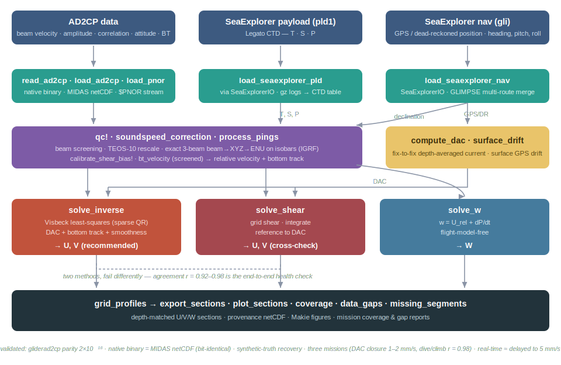

# GliderADCP.jl

Pure-Julia processing of glider-mounted Nortek AD2CP data (Alseamar SeaExplorer,
Teledyne Slocum) into absolute ocean velocity profiles: from the raw instrument
binary to referenced, quality-controlled U/V/W sections.

Implements both published approaches, from first principles, over one common trunk:

- the lADCP-tradition **shear method** — grid shear, integrate, reference to the
  depth-averaged current (Todd et al. 2017; cf. the Python
  [`gliderad2cp`](https://github.com/bastienqueste/gliderad2cp), whose transform this
  reproduces machine-exactly), and
- the Visbeck (2002) least-squares **inverse method** adapted to gliders (Todd et al.
  2017; Gradone et al. 2023; cf. [`Slocum-AD2CP`](https://github.com/JGradone/Slocum-AD2CP)),
  with composable depth-averaged-current, bottom-track, and smoothness constraints.

No Python, MATLAB, or Windows/MIDAS at runtime. SeaExplorer log parsing is shared with
[ATOMIXjulia.jl](https://github.com/oceansensing/ATOMIXjulia.jl) through
[SeaExplorerIO.jl](https://github.com/oceansensing/SeaExplorerIO.jl).

**New users: start with the [tutorial](docs/src/tutorial.md)** (the science and a worked
pipeline). Before trusting a mission's numbers, read the
**[QA/QC guide](docs/src/qaqc.md)** — most glider-ADCP data problems are silent, and it
catalogues every one this project has hit. Full validation record and the method
verdict: [docs/research/m38_validation.md](docs/research/m38_validation.md). Design
record: [PLAN.md](PLAN.md).

## The pipeline



*(Three AD2CP input routes and the SeaExplorer nav/CTD logs feed one common
per-ping trunk; navigation supplies the absolute references. The inverse and shear
methods produce U/V from identical inputs — their agreement is the health check —
and `solve_w` adds vertical velocity, all written out as gridded sections.)*

Independent layers, each with a small, testable surface. Every function below is exported.

**I/O — three AD2CP routes into one structure, plus navigation**
- **`read_ad2cp(path)`** — native `.ad2cp` binary reader (10-byte headers, checksums,
  DF3/DF20 records, embedded config string); bit-identical to the Nortek MIDAS export
  with no Windows/MIDAS step.
- **`load_ad2cp(path)`** — MIDAS netCDF (single file, directory, or vector), including
  the `AverageBT` bottom-track group.
- **`load_pnor(dir)`** — the real-time `$PNOR` ASCII telemetry stream embedded in the
  glider payload logs (0.01 m/s quantized) — for onboard/near-real-time products.
- **`load_seaexplorer_nav` / `load_seaexplorer_pld`** — SeaExplorer nav (`gli`) and
  payload (`pld1`, `legato`, …) readers via SeaExplorerIO.jl: gzipped, per-segment,
  mission-scale, with glider-computer + GLIMPSE-server multi-route merge and dedup.
  **`slocum_nav`** ingests Slocum dbd/ERDDAP tables.

**Per-ping corrections — the common trunk**
- **`soundspeed_correction` / `apply_soundspeed!`** — rescale velocities to the CTD
  sound speed (TEOS-10 via `soundspeed_from_ctd`).
- **`qc!(adcp)`** — composable beam-sample screening (correlation, amplitude window,
  SNR floor, ambiguity, surface mask, first-cell, error flags); returns per-screen
  rejection fractions. **`cell_quality`** profiles per-cell/beam correlation to show
  the effective range.
- **`process_pings(adcp; lat)`** — the exact 3-beam beam→XYZ→ENU transform on isobars
  (25° range-gating, `head2vehicle` flip, IGRF declination), returning relative
  velocities. **`magnetic_declination`** (IGRF) and **`calibrate_shear_bias!`**
  (range-dependent bias, pairwise-difference estimator) feed it.

**References from navigation**
- **`compute_dac`** — fix-to-fix depth-averaged current per yo (the absolute anchor).
- **`surface_drift`** — near-surface GPS drift, a constraint and a cross-check.
- **`bt_velocity` / `bt_valid`** — bottom-track over-ground velocity, screened by
  default for false near-field locks (see Validation §6).

**Velocity solutions**
- **`solve_inverse(pings, dac; bt)`** — the Visbeck inverse (sparse QR; DAC + optional
  bottom-track + interior smoothness). **The recommended product.**
- **`solve_shear(pings, dac)`** — the shear method, retained as an independent second
  opinion (`solve_shear_profile` / `inverse_shear` expose the shear content itself).
- **`solve_w` / `vertical_velocity`** — flight-model-free vertical water velocity
  (`w = U_rel + dP/dt`), two ways (direct and pressure-anchored).

**Products & data QA**
- **`grid_profiles`**, **`export_sections`** (provenance netCDF), **`plot_sections`**
  (Makie extension) — depth-matched sections and figures.
- **`coverage`**, **`data_gaps`**, **`missing_segments`** — structured reports of a
  mission's shape (spans, gaps, finite-data fractions, transfer-sequence gaps).
- **`compass_field_check`** — magnetometer-health diagnostic.

## Quick start

```julia
using GliderADCP

# 1. load — native binary (or MIDAS .nc, or the $PNOR stream) + navigation
adcp = read_ad2cp("sea064_M38.ad2cp")            # Average + AverageBT + Config
nav  = load_seaexplorer_nav("delayed/nav/logs")  # gli files → GPS/DR segments

# 2. correct & QC (sound speed from the payload CTD, then beam-sample screening)
apply_soundspeed!(adcp, soundspeed_correction(adcp, ctd_t, ctd_c))
qc!(adcp)

# 3. geometry + references
pings = process_pings(adcp; lat = 69.0,          # ENU relative velocity on isobars
                      declination = magnetic_declination(nav, adcp.t))
calibrate_shear_bias!(pings)                      # remove the range-dependent bias
dac = compute_dac(nav)                            # per-yo depth-averaged current
btv = bt_velocity(adcp)                           # screened over-ground velocity

# 4. solve — absolute velocity profiles, two ways, plus vertical
prof_i = solve_inverse(pings, dac; bt = btv)      # inverse (recommended)
prof_s = solve_shear(pings, dac)                  # shear (independent cross-check)
w      = solve_w(pings, dac)                       # vertical water velocity

# 5. products
sec = grid_profiles(prof_i)
export_sections("M38_inverse.nc", sec)
```

**Whole mission, symmetric over deployments** — one mission-agnostic script driven by a
shared registry runs the full chain, all diagnostics, and figures:

```bash
JULIA_LOAD_PATH="@:@ocean:@stdlib" julia +1.13 --project=. examples/currents.jl        # M37, M38, M59
JULIA_LOAD_PATH="@:@ocean:@stdlib" julia +1.13 --project=. examples/currents.jl m38     # one mission
```

**Multiple download routes** (glider computer + GLIMPSE server) merge and deduplicate,
highest resolution preserved:

```julia
nav = load_seaexplorer_nav(["delayed/nav/logs", "glimpse"]; stream = "38.gli.sub")
```

## Validation

Five independent lines, all in the test suite (328 tests) or scripted, with gated
acceptance tests that run on real missions when the data is present.

1. **Reference-implementation parity** — the beam→XYZ transform reproduces `gliderad2cp`
   to machine precision (XYZ agreement 2×10⁻¹⁶); the regridded profiles match at
   r = 0.996 (residual = their small-angle cell-depth approximation, which this package
   avoids). `Slocum-AD2CP`'s row-dropped 3-beam matrix is reproduced as a parity mode.
2. **Native binary vs MIDAS netCDF** — bit-identical on two missions (M38, M59): every
   velocity, amplitude, correlation, attitude and bottom-track sample, `max |Δvel| = 0`.
3. **Synthetic-truth recovery** — both solvers recover a prescribed depth-varying
   velocity field from synthetic pings to the bin-discretization floor (permanent tests).
4. **Three-mission cross-validation** — the full pipeline run on M37 (Jan Mayen), M38
   (Lofoten), M59 (subtropical NW Atlantic): DAC closure 1–2 mm/s, dive-vs-climb
   consistency r = 0.98 (≈2 cm/s), shear-vs-inverse agreement r = 0.92–0.98.
5. **Real-time vs delayed** — the same pipeline on the `$PNOR` telemetry stream vs the
   full-resolution binary: the inverse product is the delayed product to 3.7–5.1 mm/s
   rms with zero bias, on all three missions, independent of signal amplitude (unchanged
   through an M59 Gulf Stream jet > 1 m/s). The shear method pays 2–3 cm/s to stream
   quantization.
6. **Data-QC discovery** — on M38, 99.7% of bottom-track locks proved false (near-field
   water-borne targets); feeding them to the inverse injected a spurious 300-m shear
   layer. `bt_valid` now screens them by default (min range + impossible-bathymetry
   test), correctly rejecting all of M38's false locks while passing M37's 16 genuine
   ridge-slope locks. See the [QA/QC guide](docs/src/qaqc.md).

## Which method?

The **inverse is the production method**: it localizes sample errors that the shear
method integrates (given identically quantized input, the inverse's error stays a flat
4–5 mm/s to 1000 m while the shear method's grows with depth to 2–3 cm/s), it fuses
constraints (DAC, screened bottom track, drift) the shear method cannot, and it closes
the DAC at 1–2 mm/s on every mission. The **shear method is kept as the standard second
opinion** — the two fail differently, so their agreement is the single best end-to-end
health check (it is what exposed the false bottom-track contamination). Both stand on the
same DAC reference, so absolute accuracy remains a navigation question for either. Full
argument and its limits: [m38_validation.md](docs/research/m38_validation.md) §Method
verdict.

## Package layout

```
src/
  GliderADCP.jl     module, includes & exports
  types.jl          AD2CPData, AD2CPConfig, BottomTrackData, GliderNav, ProcessedPings
  io/
    ad2cp_binary.jl native .ad2cp binary reader (bit-fidelity core)
    nortek_netcdf.jl MIDAS netCDF (+ AverageBT) reader
    nortek_pnor.jl  $PNOR real-time telemetry-stream parser
    seaexplorer.jl  SeaExplorer nav/payload adapters (via SeaExplorerIO.jl)
    slocum.jl       Slocum dbd/ERDDAP table ingestion
  processing/
    soundspeed.jl   TEOS-10 sound speed + velocity rescaling
    qc.jl           beam-sample screening, bt_valid, cell_quality
    geometry.jl     3-beam selection, beam↔XYZ↔ENU, declination
    binmap.jl       isobaric regridding (25° range-gating)
    dac.jl          depth-averaged current, surface drift, bottom-track velocity
    declination.jl  IGRF magnetic_declination
    pipeline.jl     process_pings orchestration
    shearbias.jl    range-dependent bias calibration
    compass.jl      magnetometer-health diagnostic
    coverage.jl     coverage / data_gaps / missing_segments reporting
  solutions/
    inverse.jl      Visbeck least-squares inverse (sparse QR)
    shear.jl        shear method + shear-content products
  products/
    grid.jl         depth-matched section gridding
    vertical.jl     vertical water velocity (solve_w)
    export.jl       provenance netCDF export
ext/GliderADCPMakieExt.jl   plot_sections (activates when Makie is loaded)
docs/src/tutorial.md   step-by-step science + pipeline walkthrough
docs/src/qaqc.md       consolidated data QA/QC findings and checks
docs/research/         validation report, method verdict, literature, format analyses
examples/currents.jl              whole-mission workflow (M37/M38/M59, one script)
examples/realtime_vs_delayed.jl   $PNOR stream vs delayed-mode comparison
examples/m38_divand_sections.jl   DIVAnd-mapped continuous sections
examples/missions.jl              shared mission registry
```

## Scope notes

- **Absolute velocity is a navigation question.** Both methods reference the same
  fix-to-fix DAC; a biased dead-reckoning model shifts both products identically. The
  DAC layer is validated internally (closure 1–2 mm/s, drift consistency) but not yet
  against an independent instrument (mooring / shipboard ADCP) — that is the one open
  validation gap.
- **Everything is a yo-segment mean** (2–6 h). Inertial oscillations vector-average
  toward zero; a weak segment mean does not imply weak instantaneous currents. Time-
  resolved estimation is a research extension.
- **Effective range is shorter than configured range.** In clear water the correlation
  collapses well before the last cell (~15–17 m of a configured 30 m); `cell_quality`
  shows where, and `corr ≥ 80` is recommended for conservative shear-method work.
- **The range-dependent shear bias is mission/configuration-dependent** (−4×10⁻⁴ s⁻¹ in
  2022 vs −3×10⁻⁵ s⁻¹ in 2024 on the same instrument) — always calibrate per mission.
- **Deferred with rationale** (see PLAN.md): full Merckelbach flight model (the ADCP
  supersedes it for w and through-water speed), burst-mode EVR (no local burst data),
  compass *correction* (diagnostic in place; correction is a research task).
